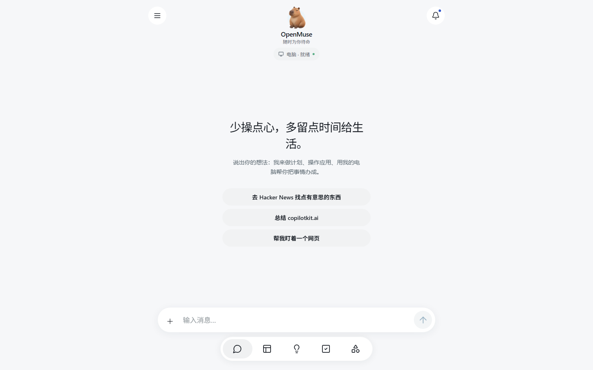
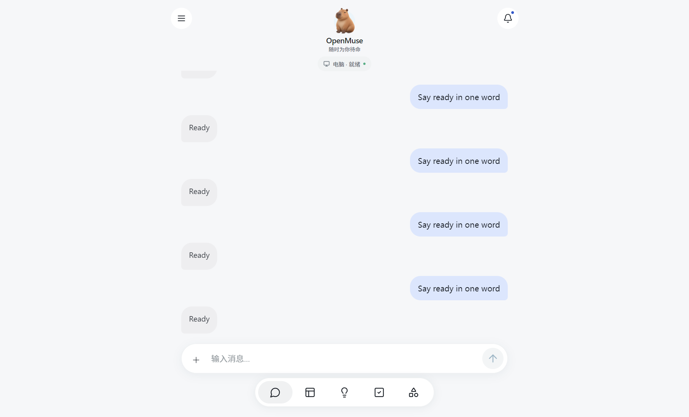
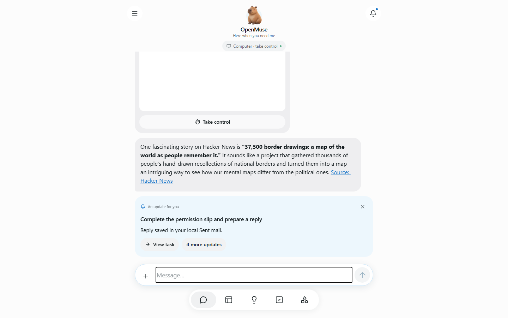
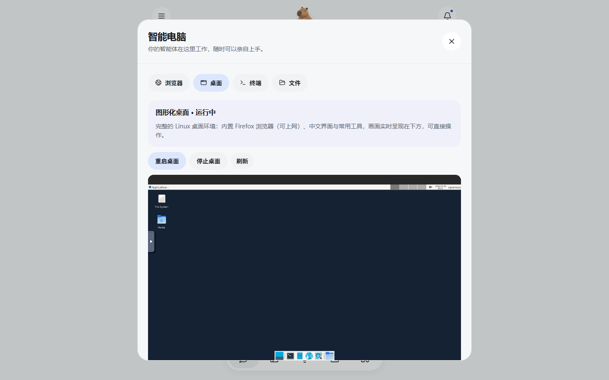
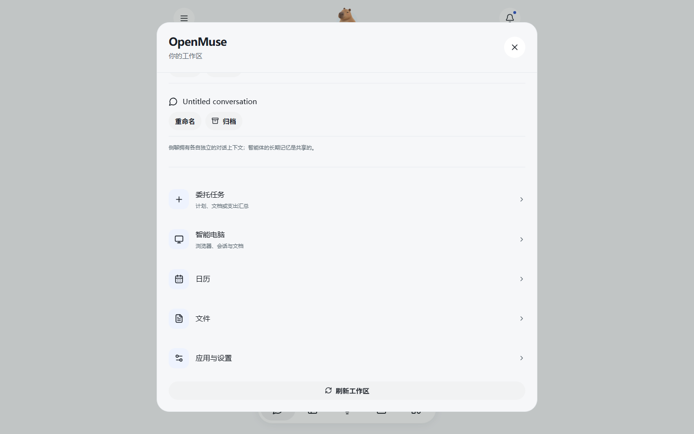
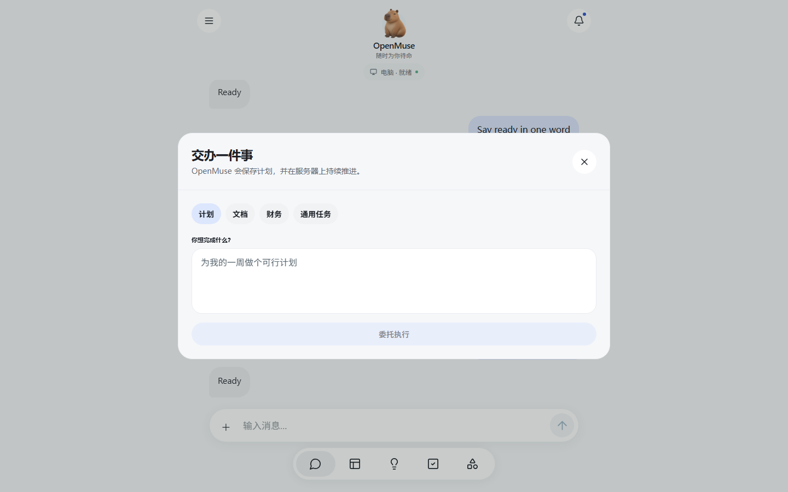

<div align="center">

# ZMuse · 国产版个人智能体工作台

**一个拥有图形化云桌面、真实浏览器和 Linux 终端的中文个人智能体。单用户 v1，开箱即用。**

[界面预览](#-界面预览) · [快速启动](#-快速启动) · [架构](#%EF%B8%8F-架构) · [与上游的差异](#-与上游-openmuse-的差异) · [路线图](#-路线图)

基于 [CopilotKit/OpenMuse](https://github.com/CopilotKit/OpenMuse)（MIT）深度改造 · 继承 MIT 协议



</div>

## 这是什么

ZMuse 把"个人智能体"从聊天框变成了一台**真正能干活的电脑**：

- 💬 **中文对话委托** —— 接入任意 OpenAI 兼容模型（含国内中转），说出需求即可
- 🌐 **真实浏览器** —— 智能体用真实 Chromium 打开网页干活，画面内嵌对话流，随时可接管
- 🖥️ **图形化云桌面**（本版本核心增量）—— 应用内直接操作一个完整 Linux 桌面：Xfce4 + Firefox，中文环境，可上网
- ⌨️ **Linux 终端 + 文件工作区** —— 有界命令、持久化 `/workspace`，与桌面环境相互独立
- 📋 **持久任务引擎** —— 计划、断点、SQL 租约，进程崩溃后可恢复；敏感动作（发邮件、改日历）必须人工审批
- 🎯 **目标与监控** —— 定时盯网页变化/文字出现/价格阈值，告警去重入箱
- 📄 **文档流水线** —— 邮件附件 → PDF 表单填写 → 回复草稿 → 审阅发送

| Windows 桌面程序 | 真实浏览委托 | 图形化云桌面 |
| --- | --- | --- |
|  |  |  |

| 会话菜单 | 委托任务 |
| --- | --- |
|  |  |

> 以上全部为真机截图：模型真实调用、浏览器真实浏览、桌面真实运行。

## 🚀 快速启动

### 方式 A：Windows 桌面程序（推荐）

```bat
git clone https://github.com/xuboboo/zmuse.git
cd zmuse
pnpm install --frozen-lockfile
pnpm build:server & pnpm build:web
docker build -t openmuse-computer:local apps/computer
docker build -t openmuse-desktop:local  apps/desktop
```

配置 `.env`（复制 `.env.example`，最少需要三项）：

```dotenv
CPK_INTELLIGENCE_API_KEY=   # CopilotKit Intelligence 项目密钥（对话持久化，必填）
AGENT_BACKEND=model
MODEL=openai/你的模型id      # 任意 OpenAI 兼容端点，国内中转亦可
OPENAI_API_KEY=sk-xxx
# OPENAI_BASE_URL=https://你的中转/v1
```

双击 **`StartOpenMuse.cmd`** —— 桌面窗口自动打开，后端全部由它托管：
关窗缩到托盘（后台任务不停）、子进程崩溃 3 秒自愈、托盘退出走优雅关停。

### 方式 B：开发三件套

```sh
pnpm dev            # API 8787
pnpm dev:browser    # 浏览器 worker 8790
pnpm dev:web        # Web 8081
```

首次使用建议跑一遍体检：`bash artifacts/e2e/post-key-check.sh`（6 项全过即就绪）。

## 🏗️ 架构

```text
Windows 桌面程序（Electron，进程编排 + 托盘 + 自愈守护）
  └── 中文 Web 界面（8081，Electron 内嵌伺服）
        └── API + 持久任务引擎（Hono + CopilotKit Runtime，8787）
              ├── 浏览器 worker（8790，真实 Chromium，可接管）
              ├── 图形化桌面容器（Xfce4 + Firefox，noVNC 仅回环，随用随启）
              ├── Linux 终端/文件容器（禁网，命令 30s 上限，/workspace 持久）
              └── 审批流：发邮件 / 改日历必须人工确认
模型：任意 OpenAI 兼容端点（含国内中转）
```

## 📦 与上游 OpenMuse 的差异

| 能力 | 上游 | ZMuse |
| --- | --- | --- |
| 图形化云桌面 | ROADMAP 未实现 | ✅ 应用内实时操作（Xfce + noVNC） |
| 中文界面与中文桌面环境 | 无 | ✅ 全站中文化 + Noto CJK + zh_CN |
| 模型接入 | 海外直连为主 | ✅ OpenAI 兼容中转开箱即用 |
| Windows 一键启动 | 无 | ✅ Electron 壳：托管后端 + 托盘 + 自愈 |
| 优雅退出 | — | ✅ 全链路 HTTP 优雅关停，杜绝数据库损坏 |

继承上游全部能力：持久任务、审批流、目标监控、文档流水线、AG-UI 协议。

## 🔒 安全与隐私

- 凭据只进 `.env`（gitignore），仓库内无任何密钥
- 图形桌面与 noVNC 仅绑定本机回环；Linux 终端容器禁网、非 root、只读根文件系统
- 敏感动作零自动执行：发邮件/改日历/删事件必须逐条审批
- 单用户部署（共享访问口令模式），非多租户认证系统

## 🗺️ 路线图

1. 会话持久化本地化：用本地 thread store 替换对 CopilotKit 云的唯一外部依赖
2. 多用户 VM 编排与配额
3. 国产模型直连预设（通义 / 智谱 / DeepSeek）
4. 桌面内输入法、分辨率自适应、音频

## 🙏 致谢

- [CopilotKit/OpenMuse](https://github.com/CopilotKit/OpenMuse) —— 上游项目，MIT 协议。ZMuse 的任务引擎、审批流、AG-UI 集成均基于它
- [CopilotKit](https://github.com/CopilotKit/CopilotKit) —— React Native/AG-UI 运行时
- [noVNC](https://github.com/novnc/noVNC)、[Xfce](https://xfce.org/) —— 图形化桌面基础

## 📄 协议

[MIT](LICENSE) © OpenMuse contributors。ZMuse 改造部分同样以 MIT 发布。

网站、邮件与文档内容对智能体而言是证据而非行动许可；请勿将本项目用于任何违反当地法律法规的用途。
