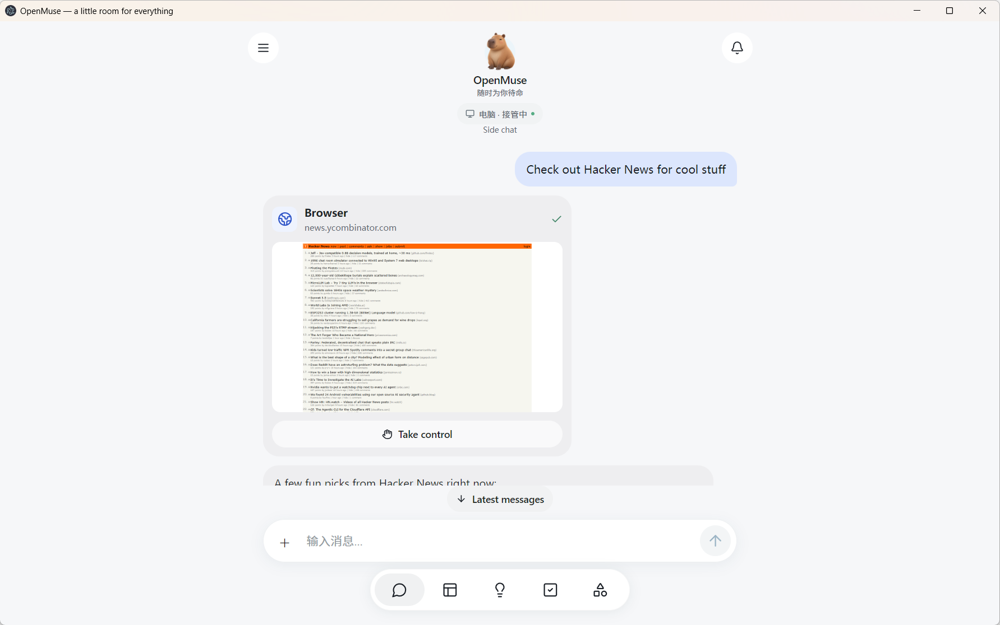
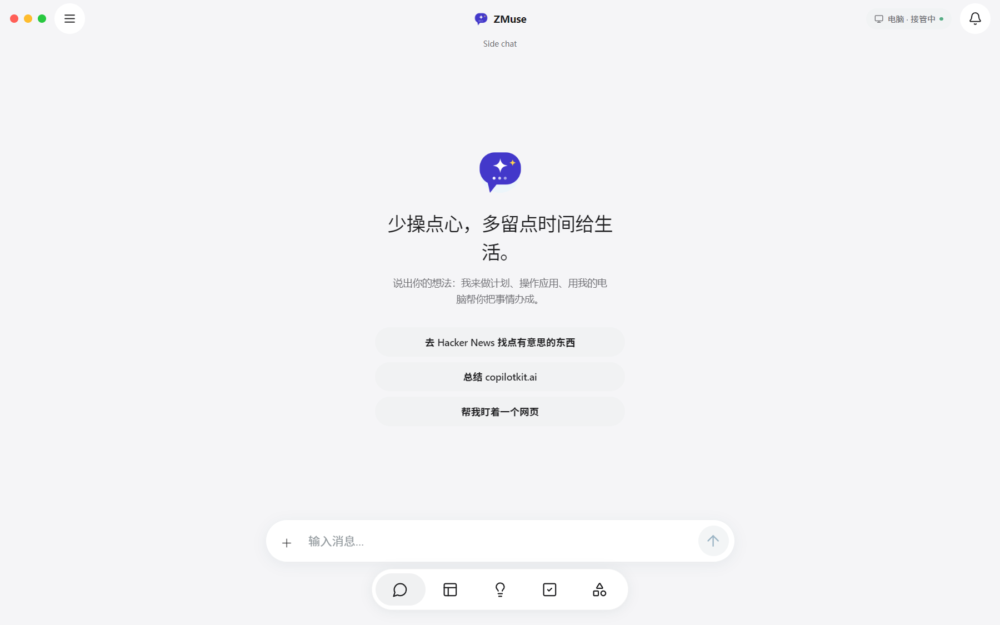

<div align="center">


**一个拥有图形化云桌面、真实浏览器和 Linux 终端的中文个人智能体。**

[](LICENSE)


[快速开始](#-快速开始) · [界面一览](#%EF%B8%8F-界面一览) · [架构](#%EF%B8%8F-架构) · [安全与隐私](#-安全与隐私) · [路线图](#%EF%B8%8F-路线图)

</div>

---

<div align="center">



*实机画面：一句 "Check out Hacker News for cool stuff" —— 智能体的真实浏览器正在读 Hacker News，画面实时可见，随时接管。*

</div>

## ✨ ZMuse 是什么

ZMuse 把"AI 聊天框"升级成"**会干活的电脑**"。你说目标，它规划并执行：

- **🌐 真实浏览** —— 智能体用真实 Chromium 打开网页搜集信息，过程内嵌对话流，随时接管
- **🖥️ 图形化云桌面** —— 应用内直接操作完整 Linux 桌面（Xfce + Firefox，中文环境，可上网）
- **⌨️ Linux 终端 + 文件工作区** —— 有界命令、持久化工作区，浏览器与终端相互隔离
- **📋 委托而非等待** —— 任务后台持久执行：计划、断点、租约、崩溃恢复
- **✋ 人工审批** —— 发邮件、改日历等敏感动作必须逐条确认
- **🎯 目标监控** —— 定时盯网页变化 / 文字出现 / 价格阈值

## 🖼️ 界面一览

| 图形化云桌面（应用内实时操作） | 真实浏览委托（Hacker News 实测） |
| --- | --- |
|  |  |

| 会话管理 | 委托任务 |
| --- | --- |
|  |  |

<details>
<summary><b>更多界面</b>（点击展开）</summary>

| 中文首页 | Windows 桌面程序全窗 |
| --- | --- |
|  |  |

</details>

## 🚀 快速开始

### 前置要求

- Windows 10/11 · Node.js 22+ · pnpm 10+ · Docker Desktop
- 一个 CopilotKit Intelligence 项目密钥（[获取](https://github.com/CopilotKit/OpenMuse)）
- 任意 OpenAI 兼容模型密钥（海外直连或国内中转均可）

### 方式 A：Windows 桌面程序（推荐）

```bat
git clone https://github.com/xuboboo/zmuse.git
cd zmuse
pnpm install --frozen-lockfile
pnpm build:server & pnpm build:web
docker build -t openmuse-computer:local apps/computer
docker build -t openmuse-desktop:local  apps/desktop
```

复制 `.env.example` 为 `.env` 并填入密钥，然后双击 **`StartOpenMuse.cmd`**：

- 自动拉起 API、浏览器 worker 与中文界面
- 关窗缩到托盘，后台任务继续；子进程崩溃 3 秒自愈
- 托盘退出走优雅关停，不伤数据

### 模型接入预设（国内中转即插即用）

`.env` 里三个变量切换任意中转，无需改代码：

```dotenv
AGENT_BACKEND=model
MODEL=openai/你的模型id
OPENAI_API_KEY=sk-xxx
OPENAI_BASE_URL=https://你的中转/v1
```

| 中转/平台 | OPENAI_BASE_URL | 备注 |
| --- | --- | --- |
| [AgentRouter](https://agentrouter.org) | `https://agentrouter.org/v1` | GitHub 登录注册，开发者免费额度 |
| OpenRouter | `https://openrouter.ai/api/v1` | 全球聚合，模型最全 |
| 自建/其他中转 | `https://你的中转/v1` | 任意 OpenAI 兼容网关 |

### 全天候自主运行

- 开机自动启动：开始菜单「启动」文件夹放入 `StartOpenMuse.cmd` 快捷方式
- 关窗缩到托盘：API 与后台任务持续运行，浏览器 worker 自动重启（自愈守护）
- 智能体可自主操控图形化云桌面完成任务（见界面一览）

### 方式 B：开发三件套

```sh
pnpm dev            # API 8787
pnpm dev:browser    # 浏览器 worker 8790
pnpm dev:web        # Web 8081
```

## 🏗️ 架构

```text
Windows 桌面程序（Electron：进程编排 + 托盘 + 自愈守护）
  └── 中文 Web 界面（8081，Electron 内嵌伺服）
        └── API + 持久任务引擎（Hono + CopilotKit Runtime，8787）
              ├── 浏览器 worker（8790，真实 Chromium，可接管）
              ├── 图形化桌面容器（Xfce4 + Firefox，noVNC 仅回环，随用随启）
              ├── Linux 终端/文件容器（禁网，命令 30s 上限，/workspace 持久）
              └── 审批流：发邮件 / 改日历必须人工确认
模型：任意 OpenAI 兼容端点（海外直连或国内中转）
```

## 🔒 安全与隐私

- 凭据只进 `.env`（gitignore），仓库内无任何密钥
- 图形桌面与 noVNC 仅绑定本机回环；终端容器禁网、非 root、只读根文件系统
- 敏感动作零自动执行：发邮件 / 改日历 / 删事件必须逐条审批
- 单用户部署（共享访问口令模式），非多租户认证系统

## 📦 与上游 OpenMuse 的差异

| 能力 | 上游 | ZMuse |
| --- | --- | --- |
| 图形化云桌面 | ROADMAP 未实现 | ✅ 应用内实时操作（Xfce + noVNC） |
| 中文界面与中文桌面环境 | 无 | ✅ 全站中文化 + Noto CJK + zh_CN |
| 模型接入 | 海外直连为主 | ✅ OpenAI 兼容中转开箱即用 |
| Windows 一键启动 | 无 | ✅ Electron 壳：托管后端 + 托盘 + 自愈 |
| 优雅退出 | — | ✅ 全链路 HTTP 优雅关停，杜绝数据库损坏 |

继承上游全部能力：持久任务、审批流、目标监控、文档流水线、AG-UI 协议。

## 🗺️ 路线图

- [ ] 会话持久化本地化：用本地 thread store 替换对 CopilotKit 云的唯一外部依赖
- [ ] 多用户 VM 编排与配额
- [ ] 国产模型直连预设（通义 / 智谱 / DeepSeek）
- [ ] 桌面内输入法、分辨率自适应、音频

## 🙏 致谢

- [CopilotKit/OpenMuse](https://github.com/CopilotKit/OpenMuse) —— 上游项目（MIT）。ZMuse 的任务引擎、审批流、AG-UI 集成均基于它
- [CopilotKit](https://github.com/CopilotKit/CopilotKit) —— React Native / AG-UI 运行时
- [noVNC](https://github.com/novnc/noVNC)、[Xfce](https://xfce.org/) —— 图形化桌面基础

## 📄 协议

[MIT](LICENSE) © OpenMuse contributors。ZMuse 改造部分同样以 MIT 发布。

网站、邮件与文档内容对智能体而言是证据而非行动许可；请勿将本项目用于任何违反当地法律法规的用途。
